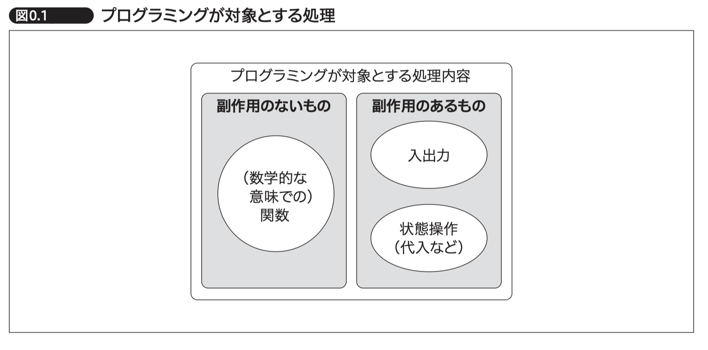

<style>
.text {
  position: absolute;
  top: 50%;
  left: 50%;
  width: 75%;
  transform : translate(-50%,-50%)
}
span {
  color: red;
}
</style>
# Tech Talk
関数プログラミング入門


masatora 2021/05/27
<!--
comment
-->
---

## このテーマを扱う動機
<div>
<h2 class="text">1. Scalaを使っている会社でアルバイトを始めたので勉強したい<br>
2. 面白かったので共有したい</h2>

</div>

<!--
そんなに詳しくないので詳しい人いたらいろいろ指摘ください
-->
---

# ターゲット
<div>
<h2 class="text">命令型言語でのプログラミング経験があるが、関数プログラミングの経験はない人</h2>
</div>
<!--
comment
-->
---

# ゴール
<div>
<h2 class="text">関数プログラミングがどんな感じかイメージできるようになってもらう</h2>
</div>

<!--
- 関数プログラミングがなんなのか
- なぜ生まれたのか
- 何が嬉しいのか
- 考え方
- こんな感じで書いていくんだな〜という
-->
---

# 参考文献

- [関数プログラミング実践入門](https://amzn.to/2RuqPRT)
- [関数プログラミングはなぜ重要か](https://www.sampou.org/haskell/article/whyfp.html)
- [Scala研修テキスト by ドワンゴ](https://scala-text.github.io/scala_text/)
- [Scala関数型デザイン&プログラミング](https://amzn.to/3oQLThL)
- [カリー化と部分適用（JavaScriptとHaskell）](https://qiita.com/7shi/items/a0143daac77a205e7962)

---

# 目次

-  **関数プログラミングのデモ**    - 関数プログラミングではどんな感じで問題を解くか簡単にデモします。
-  **関数プログラミングとはなにか**  - 関数プログラミングとはなにか説明します。
-  **関数型言語とはなにか**       - 関数型言語とはなにか説明します。
-  **関数プログラミングの何が嬉しいか** - 関数プログラミングのメリットを説明します。
-  **いろんな言語に見られる関数プログラミングの影響** - 最近のプログラミング言語は関数プログラミングの要素を取り入れている事が多いので紹介します。
-  **関数プログラミングをやってみる** - 実際に手を動かしてもらえるような問題を用意しました。

---
layout: cover
---

# 関数プログラミングのデモ
---

# うんこ
unko
---
layout: cover
---

# 関数プログラミングとはなにか

---

# 関数プログラミングとは

<div>
<h2 class="text">関数プログラミングとは<span>プログラミングパラダイム</span>の1つ</h2>
</div>

---

## プログラミングのパラダイム

有名なプログラミングパラダイムとして、以下の３つがある。

1. <span>命令型プログラミング</span>のパラダイム
2. <span>オブジェクト指向プログラミング</span>のパラダイム
3. <span>関数プログラミング</span>のパラダイム
---

## 1. 命令型プログラミングのパラダイム
<div>
<h2 class="text">プログラムとは、<span>計算機が行うべき命令の列</span>であるとするパラダイム。</h2>
</div>
<!--
Cとか
-->
---

## 2. オブジェクト指向プログラミングのパラダイム
<div>
<h2 class="text">プログラムとは、<span>オブジェクトとそのメッセージング</span>であるとするパラダイム。</h2>
</div>

<!--
C++, Java, Rubyとかいっぱいある
-->
---

## 3. 関数プログラミングのパラダイム
<div>
<h2 class="text">プログラムとは、<span>関数</span>であるとするパラダイム。値に<span>関数</span>を適用していくことで計算をすすめる。</h2>
</div>

<!--
-->
---

## 関数とはなにか

関数プログラミングにおける関数とは、数学的な意味での関数。

すなわち、与えられた入力の値のみから出力となる値をただ１つ決める規則のこと。

言い換えると、プログラミングが対象とする処理内容のうち、副作用のないもの。

<br>
<br>
<br>
<br>

      
$$
\begin{array}{c}

f(x)

\end{array}
$$

<!--
comment
-->
---

## 副作用とは

副作用とは、状態を参照し、あるいは状態に変化を与えることで、次回以降の結果にまで影響を与える効果のこと。



<style>
  img { 
    height: 300px;
    object-fit: fill;
  }
</style>
<!--
comment
-->
---
layout: cover
---

# 関数型言語とはなにか

---

## 関数型言語とはなにか

<div>
<h2 class="text">関数型言語とは、<span>関数が第一級の対象</span>である言語のこと。</h2>
</div>

---

## 第一級の対象であるとは
「第一級の対象である」とは、その言語において<span>単なる値と同じように扱われる</span>ということ。言い換えると、以下の特徴を与えられているということ。

1. リテラルがある
2. 実行時に生成できる
3. 変数に入れて扱える
4. 手続きや関数に引数として与えることができる
5. 手続きや関数の結果として返すことができる
---

## 1. リテラルがある

関数型言語では、文字列や数値と同様に、関数にもリテラルが与えられている。たとえば、引数に1を足す関数は

```hs
(λ x . x + 1)
```

という風に表せる。この関数に2を適用すると

```hs
(λ x . x + 1) (2) = 2 + 1 = 3
```

<!--
『適用する』とは関数の引数に値を与えること
-->
---

## 2. 実行時に生成できる

関数型言語では、(関数合成、部分適用や高階関数等によって)関数を実行時に生成できる。

---

## 2. 実行時に生成できる ~部分適用とは~

関数の一部にだけ引数を与えて関数を作ること。例えば、２つの引数の合計を返す関数`add`を以下のように定義する。

```hs
add x y = x + y
```

以下のようにaddに部分適用を行なって新しい関数`add1`を作る。`add1`は<span>引数を１つとって、引数に1を足して返す</span>関数になる。

```hs
-- 部分適用
add1 = add 1

-- 使用例
> add1 2
3
```

---

## 2. 実行時に生成できる ~高階関数とは~
<br>

- 結果が関数になる関数
- 引数として関数を要求する関数

を<span>高階関数</span>という(詳細は後のページで説明)。


---

## 3. 変数に入れて扱える

関数型言語では、関数を<span>変数に入れて扱う</span>ことができる。

---

## 4. 手続きや関数に引数として与えることができる

定義域が特定の関数の集合となるような関数を作ることができる。

例えば、<span>関数を引数にとって、その関数に2を適用した結果になる</span>関数を以下のように作れる。

```hs
(λ f . f(2))
```

この関数に先程の関数`(λ x . x + 1)`を適用すると

```hs
(λ f . f(2)) ((λ x . x + 1)) = 2 + 1 = 3
```

となる。↑は高階関数

---

## 5. 手続きや関数の結果として返すことができる

値域が特定の関数の集合となるような関数を作ることができる。

i.e. 関数の結果として関数を返すことができる。

例えば、『値を１つ取って、その値を足す』関数を返す関数を以下のようにして作れる。

```hs
(λ a . (λ b . b + a))
```

上記の関数に1を適用すると
```hs
(λ a . (λ b . b + a))(1) = (λ b . b + 1)
```

となり、『引数に1を足して返す』関数ができる。


---

## 命令型言語と関数型言語の違い

命令型言語と関数型言語の違いは主に2つ。

1. 手続きを書く vs 結果の性質を宣言する
2. 代入 vs 束縛

---

## 1. 手続きを書く vs 結果の性質を宣言する

命令型言語では、ある目的を達成するため、

- 値をどこに格納するのか(代入)
- どこから値を取り出してくるのか(参照)
- 次にどの手続に飛ぶのか(手続きの呼び出し)

といったような挙動を記述する。

<br>

関数型言語では、<span>結果の性質を宣言する</span>ことによって目的を達成する。

---

## 2. 代入 vs 束縛

関数型言語では、変数への代入は許されていないか、もしくは非常に限定されている。

代入の代わりに、一度変数の値を決めたら変更不可能になる<span>束縛</span>を用いる。


例えるなら、C言語ですべての変数に`const`をつけるようなもの

---

## 関数型言語の例

- Clojure
- Coq
- Erlang
- F#
- Haskell
- Idris
- OCaml
- Scala
- SML

---

## 関数型言語の分類
以下の6つの視点で分類する。

1. 動的型付けと静的型付け
2. 型付けの強弱
3. 純粋
4. 型推論
5. 依存型
6. 評価戦略


<style>
  img {
    position:absolute; 
    top:5%; 
    right:5%;
    width: 60%;
  }
</style>

---

## 1. 動的型付けと静的型付け

関数型言語には、静的型付け言語と動的型付け言語とが存在する。

- 静的型付け言語とは、型検査を<span>コンパイル時</span>に行う。

- 動的型付け言語は、<span>実行時</span>に型検査を行う。

---

## 2. 型付けの強弱

- 型検査(型に整合性があるかを検査する機能)に成功すれば安全性が保証される型付けを<span>強い型付け</span>

- 型検査に成功しても安全性が保証されない型付けを<span>弱い型付け</span>という。

---

## 3. 純粋

純粋とは、同じ式はいつ評価しても同じ結果になる<span>参照透過性</span>という性質を持っていること。

---

## 4. 型推論

型推論とは、陽に与えられた型の情報から、陽に与えられていない部分の型も推論してくれる機能。

---

## 5. 依存型

依存型とは、他の型に依存した型や、値に依存した型を作れる機能。

---

## 6. 評価戦略

評価戦略とは、<span>どのような順番で式を評価するか</span>という規則のこと。評価戦略には大きく2種類ある。

1. 積極評価: 引数を渡される前に評価する
2. 遅延評価: 必要になるまで評価されない

---

## 関数型言語の歴史
- [ ] pdfにすると位置おかしい


<style>
  img { 
    height: 500px;
    object-fit: fill;
  }
</style>

---

# 関数型言語のこれから

- これからの関数型言語は、言語の制約の記述力を高め、その制約を言語やライブラリが把握・利用できる方向に進むだろう
- 航空・宇宙・医療・原子力等、システムのバグが人命等に関わる分野で今後採用される可能性がある

---

# 関数型言語が採用されている分野/プロダクト

- Twitter(scala)
- LinkedIn(scala)
- Foursquare(scala)
- Tabbles(F#)
- manaba(Haskell)

等

<div class="p-3">
  <Tweet id="20" />
</div>

---
layout: cover
---

# 関数プログラミングの何が嬉しいか
---

## 関数プログラミングのメリット

関数プログラミングのメリットは大きく以下の5つである。

1. コード量が少なくなる
2. 最適化がしやすい
3. 並行/並列化がしやすい
4. バグり/バグらせにくい
5. ドキュメントが少なくなる

---

## 1. コード量が少なくなる

抽象的な表現力が高く、かつ宣言的に記述できるため、記述が簡潔になる。

---

## 2. 最適化がしやすい


通常よく行われる最適化手法(ループ、データフロー、SSAなどの最適化・アセンブラレベルのコード生成最適化)に加えて、数学的な性質を利用した最適化を行いやすい。

---

## 3. 並行/並列化がしやすい

- いくつかの関数型言語ではSTMというDBのトランザクションおよびリトライ機構に似た機構を備えており、排他制御を簡単に扱える。
- (純粋な言語は)参照透過性を満たしていることが自明であるため、簡単に並列化できる。

---

## 4. バグり/バグらせにくい

高度な制約条件を型として表現でき、かつその制約条件が守られていることをコンパイル時にチェックできるため、『正しくない』使い方がされづらい。

---

## 5. ドキュメントが少なくなる

高度な制約条件が守られているかどうか言語がチェックしてくれるため、その制約条件についてのドキュメンテーションの必要がなくなる。

---

## 関数型言語のメリット

関数型言語のメリットは大きく以下の5つである。

1. 宣言的であることのメリット
2. 制約の充足をチェックしてくれるメリット
3. 型と型検査があることのメリット
4. 型推論のメリット
5. 束縛によるメリット

---

## 1. 宣言的であることのメリット

「結果が満たすべき性質」を書くだけで良いため、記述が簡潔になる。

---

## 2. 制約の充足をチェックしてくれるメリット

言語機能として課せられたか、もしくはプログラマが与えた制約が守られていることを言語がチェックしてくれる。それによって、プログラマが注意を払う必要のある事柄が減る。

---

## 3. 型と型検査があることのメリット


関数の引数として、その関数の定義域に収まらない値が与えられる(合成できない関数同士を合成してしまう場合等)ことを事前に防ぐことができる。

---

## 4. 型推論のメリット

逐一型を書かなくて良いため楽。

---

## 5. 束縛によるメリット

破壊的代入がないため、コードリーディングが楽。

---
layout: cover
---

# いろんな言語に見られる関数プログラミングの影響
---

## 1. ラムダ式

- [ ] いろんな言語のラムダ式書く
- [ ] ラムダ式とはなにか書く

<!-- 
ラムダ式とは、
 -->
---

## 2. 部分適用
RubyやC++, Python, Goで導入されている。

- [ ] C++
- [ ] Go
---

# データ型定義とパターンマッチ
Rust, Swift

- [ ] 書く
- [ ] データ型定義とパターンマッチがなんなのか説明できるようにする

---

# 型システムの強化
型推論
---

# モナド

Java, Swift
- [ ] SwiftのOptionalモナドとか書く
- [ ] モナドとはなにか説明できるようにする
---

# その他
その他にも関数プログラミングの影響を受けた機能は色々あります。
- C++のコンパイル時計算
- Swift・Rubyの演算子定義
- Python, C#のリスト内包表記

等々

---
layout: cover
---

# 関数プログラミングをやってみる
1. a
2. v
---

# a

Unko